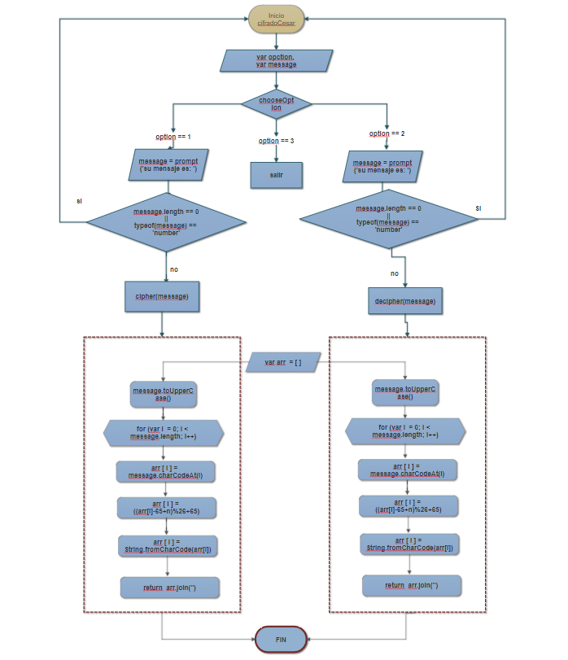

## VALID CARD
#### Contenido:
1. Diagrama de flujo validCard.
2. Pseudocódigo validCard.
3. Ejecución del código en JS.
4. Explicación del código.
- - - - -- -

### 1. DIAGRAMA DE FLUJO

### 2. PSEUDOCÓDIGO

        INICIO PROCESO
          var message, option, arr;

        hacer
          leer opciones  

            enCasoDe(true)

              caso(option == 1):                  
                escribir message  
                si ( longitugMessage == 0 ó tipoDeDato_message  == 'number')
                  leer 'ERROR'
                sino cipher <-- message
              parar

              caso(option == 2):
                escribir message  
                  si ( longitugMessage == 0 ó tipoDeDato_message  == 'number')
                    leer 'ERROR'
                  sino descipher <-- message
              parar

              caso(option == 3):
              parar

              default: mostrar ('No hay esa opción')

        mientras((option != 1) && (option != 2) && (option != 3));

        FIN PROCESO

        -----------------------------------------------------------------------------

        INICIO subProceso

          función cipher <--- (message)
            message = messageMayuscula

            para ( var i = 0; i < longitudMessage; i++)
              array[i] = valorUnicodeMessage
              array[i] = formulaCifradoCesar // (( arr[i] - 65 + n ) % 26 + 65)
              array[i] = devolverletraValorUnicode

          retorna mostrar message cifrado

        FIN subProceso

        ------------------------------------------------------------------------------

        INICIO subProceso

          función cipher <--- (message)
            message = messageMayuscula

            para ( var i = 0; i < longitudMessage; i++)
              array[i] = valorUnicodeMessage
              array[i] = formulaDescifradoCesar // (( arr[i] + 65 - n ) % 26 + 65)
              array[i] = devolverletraValorUnicode

          retorna mostrar message cifrado

        FIN subProceso

### 3. CÓDIGO

        var arr = [];

        function cipher(sentence, n){
            for(var i = 0; i < sentence.length; i++){
                //guardo en el array los indices del ASCII de las posiciones de las letras de la frase introducida
                arr[i] = sentence.charCodeAt(i);
                //almaceno en el mismo array la nueva posicion de la letra, ahora encriptada con un desplazamiento de n = 33;
                arr[i] = (( arr[i] - 65 + n ) % 26 + 65);
                //Con el mismo array, guardo la letra de la posicion asignara anteriormente
                arr[i] = String.fromCharCode(arr[i]);
        }
            // retorno el array  en el nuevo tipo de valor string, usando join
            return document.write ( 'Su mensaje CIFRADO es: \n' + arr.join('') );
        }

        function decipher(sentence,n){
            for(var i = 0; i < sentence.length; i++){
                //guardo en el array los indices del ASCII de las posiciones de las letras de la frase introducida
                arr[i] = sentence.charCodeAt(i);
                //almaceno en el mismo array la nueva posicion de la letra, ahora encriptada con un desplazamiento de n = 33;
                arr[i] = (( arr[i] + 65 - n ) % 26 + 65);
                //Con el mismo array, guardo la letra de la posicion asignara anteriormente
                arr[i] = String.fromCharCode( arr[i] );
        }
            // retorno el array  en el nuevo tipo de valor string, usando join
            return document.write ( 'Su mensaje DECIFRADO es: \n' + arr.join('') );
        }

        var sentence = '';
            //creo un flujo repetivo para mostrar las opciones y escribir la frase a encriptar o desencriptar
            do{ var option = prompt("Ingrese el número de la opción que desee: \n" +
                                       "1. Cifrar su mensaje. \n"+
                                       "2. Descifrar su mensaje.\n" +
                                       "3. Salir")

                switch(true){

                    case (option == 1):
                        //convierto la frase en mayuscula
                        sentence = prompt('Su mensaje es: ').toUpperCase();
                        //condiciona q la frase sea vacia o numeral
                        if(sentence.length == 0 || typeof(sentence) == 'number'){
                            alert('error no se ingresa campo vacio o numeral');
                        // llamo a la funcion cipher
                        }else  cipher(sentence, 33);

                    break;

                    case (option == 2):
                        //convierto la frase en mayuscula
                        sentence = prompt('Su mensaje  es: ').toUpperCase();
                        //condiciona q la frase sea vacia o numeral
                        if(sentence.length == 0 || typeof(sentence) == 'number'){
                            alert('error no se ingresa campo vacio o numeral');
                        // llamo a la funcion decipher
                        }else decipher(sentence, 33);

                    break;
                    // si se da el caso 3,sale de todo
                    case (option == 3):

                    break;

                    default:
                        //En caso se escriba otra opcion, mostar un alert de que no existe esa opcion
                        alert('No hay esa opción');
                }
            // dgenerar el nuevo bucle si las opciones son diferente a 1, 2 ó 3
            } while((option != 1) && (option != 2) && (option != 3));
